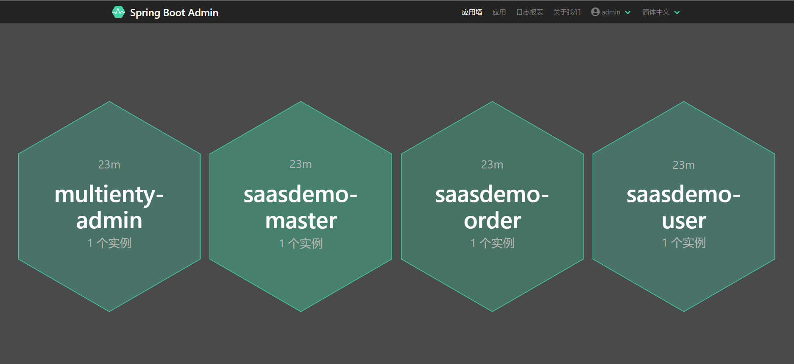

<div align="center">
  
# Multi Tenant Solution for SAAS (Micro Services)

English | [简体中文](./README.zh.md)


</div>

Multienty (/ˈmʌltɪˌentɪ/) integrates multiple mature middleware to provide you with a one-stop solution.

This project is based on Springboot, with a version requirement of ***2.6.13***. Please ensure that your development environment matches this project before use.

## Gateway & OAuth
We use Spring Webflux in gateway and OAuth authorization services, and the reason why we do not use Spring WebMVC is that webflux supports responsive stream programming, while gateway and authentication nodes have relatively simple business logic and can support larger concurrency.

The performance test results can refer to::

[Spring MVC and Spring Webflux performance testing, who is stronger？](https://www.cnblogs.com/hefeng2014/p/17759037.html)


- multienty-gateway **Gateway Service** default port:9999
- multienty-oauth **OAuth Authorization Service** default port:9998


## Database

Multienty integrates ***Shardingsphere***, ***DynamicDatasource***, and ***Flyway***, providing stable support for database sharding, data encryption, data migration, multiple data sources, and read/write separation.

## Code Generate
In the controller of the basic library, we have encapsulated the ***/code/generate*** interface. Common CURD operations can generate code with just one click by calling this interface. Similarly, code generation rules can be configured in Nacos and support hot updates without the need to restart the application.

Multienty can recognize the sharding rules configured in ***shardingsphere*** and automatically generate sharding based source code.

In addition, we also provide various page code generation for backend management UI. you can see ***/vue/code/generate***

## Join Query

***mybatis-plus-join-boot-starter*** has extended mybatis-plus and provided join query functionality. On this basis, we have further encapsulated it so that you can easily perform associated queries in the code.

example:
```
List<OrderDTO> list = selectJoinList(OrderDTO.class, MTJoinWrappers.lambda(Order.class)
                    .selectAll(Order.class)
                    .selectAssociation(OrderDetail.class, OrderDTO::getDetail)
                    .leftJoin(OrderDetail.class, OrderDetail::getOrderId, Order::getOrderId)
                    .eq(Order::getTenantId, tenantId)
                    .eq(Order::getTradeId, tradeId)
                    .ge(Order::getCreateTime, TimeUtil.minTime(createTime.toLocalDate()))
                    .le(Order::getCreateTime, TimeUtil.maxTime(createTime.toLocalDate()))
            );
```

## Nacos config center
Multienty has implemented the acquisition and update of nacos configuration. Please develop your own UI interface. It is recommended to cooperate with ShardingArgorithmTool to achieve dynamic creation and update of independent tenants.

## Service Monitor
spring-boot-admin can provide service monitoring function and can send emails in case of service abnormalities. **multienty-admin** integrates spring-boot-admin and simplifies configuration.


## Basic Data Table
multienty-core-mysql-resource project provides some basic data tables that you can refer to in the Maven pom file, and then configure them in the Nacos configuration as follows:
```
spring.multienty.base-module-enabled = true
```
## Strategies
- file upload
    - Implemented local and Alioss mode.
- payment
    - Implemented wechat pay v3 interface.
- sms
    - Implemented Aliyun interface.

## More features
For more features, you can contact the author or read the source code yourself.
```
wx: kutasms
email:7437280@qq.com
```

## List of third-party components
- redis 3.7.1
- druid 1.2.9
- dubbo 3.0.8
- dynamic datasource 4.2.0
- mybatis-plus 3.5.5
- redisson 3.9.1
- flyway 7.15.0
- nacos 2.2.0
- shardingsphere 5.2.1
- sentinel 1.8.6
- seata 1.6.1
- jjwt 0.11.1
- amqp 2.4.9


## Contribute

Welcome interested friends to participate and work together to improve this project.
