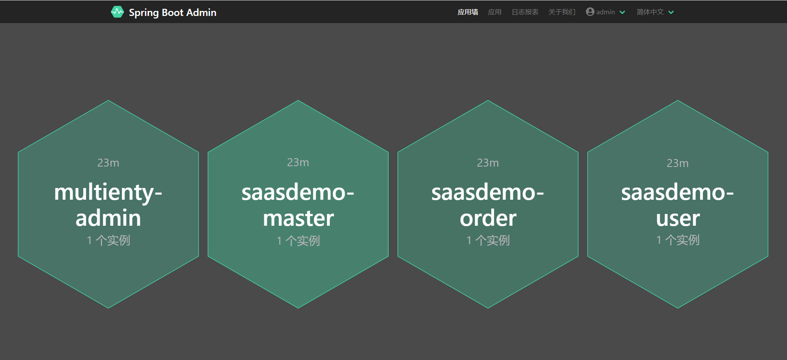

<div align="center">

# SAAS多租户解决方案 (Spring微服务版)

 [English](./README.md) | 简体中文


</div>

Multienty集成了多个优秀的中间件，为您提供一站式多租户SAAS平台开发解决方案。

本项目基于Springboot***2.6.13***. 在接入之前请确认您的开发环境可支持.


## 案例
为了让各位更好的使用Multienty,我们编写了demo并将整个demo项目开源,感兴趣的朋友可前往围观。

[github地址](https://github.com/kutasms/saas-demo)

[gitee地址](https://gitee.com/kutasms/saas-demo)

我们在知乎编写了详细的教程，地址如下：

[SaaS平台开发实战(一)：快速搭建环境](https://zhuanlan.zhihu.com/p/683628573)

[SaaS平台开发实战(二)：基础服务模块](https://zhuanlan.zhihu.com/p/683660274)

[SaaS平台开发实战(三)：用户服务模块](https://zhuanlan.zhihu.com/p/683753657)

[SaaS平台开发实战(四)：让基础模块和用户模块运行起来](https://zhuanlan.zhihu.com/p/683760795)

[SaaS平台开发实战(五)：订单服务模块](https://zhuanlan.zhihu.com/p/683873298)

[SaaS平台开发实战(六)：模拟客户下订单](https://zhuanlan.zhihu.com/p/684010126)

[SaaS平台开发实战(七)：链表查询和分布式事务](https://zhuanlan.zhihu.com/p/684278490)

[SaaS平台开发实战(八)：multienty-Admin服务状态监听](https://blog.csdn.net/baiyinianhua/article/details/136412971)

## 网关 & OAuth鉴权
在网关和OAuth授权服务中我们使用Spring-Webflux,之所以不使用spring-WebMVC的原因是webflux基于响应式流编程支持，而网关和鉴权节点相对业务逻辑较简单，可支持更大并发量。

性能测试结果可参考:

[Spring MVC 与 Spring Webflux 性能测试，谁更强？](https://www.cnblogs.com/hefeng2014/p/17759037.html)


- multienty-gateway **网关服务** 默认端口9999
- multienty-oauth **授权服务** 默认端口9998

## 数据库

Multienty 集成了 ***Shardingsphere***, ***DynamicDatasource***以及***Flyway***, 可提供稳定的数据分片, 数据加密, 数据迁移, 多数据源, 以及读写分离等能力.

### 关联查询

***mybatis-plus-join-boot-starter*** 继承自 mybatis-plus,扩展了关联查询.在此基础上，我们对其进行了进一步封装，以便您可以轻松地在代码中执行关联查询。

例:
```
List<OrderDTO> list = selectJoinList(OrderDTO.class, MTJoinWrappers.lambda(Order.class)
                    .selectAll(Order.class)
                    .selectAssociation(OrderDetail.class, OrderDTO::getDetail)
                    .leftJoin(OrderDetail.class, OrderDetail::getOrderId, Order::getOrderId)
                    .eq(Order::getTenantId, tenantId)
                    .eq(Order::getTradeId, tradeId)
                    .ge(Order::getCreateTime, TimeUtil.minTime(createTime.toLocalDate()))
                    .le(Order::getCreateTime, TimeUtil.maxTime(createTime.toLocalDate()))
            );
```

## 代码生成
在基础库的Controller中, 我们封装了 ***/code/generate*** 接口. 普通的CURD操作可以通过调用这个接口，只需点击一下就可以生成代码。代码生成规则可以在Nacos中配置，并支持热更新，而无需重新启动应用程序。

Multienty可以识别***shardingsphere***中配置的分片规则，并自动生成基于分片的源代码。

此外，我们还为后端管理UI提供各种页面代码生成。更多详情请月度 ***/vue/code/generate***接口相关信息，并且我们提供了vue代码生成配置文件示例。


## Nacos配置中心

Multienty已经实现了nacos配置的获取和更新。请开发您自己的UI界面。建议与ShardingArgorithTool合作，实现独立租户的动态创建和更新。

## 服务监听
spring-boot-admin可以提供服务监控功能，并可以在服务异常时发送电子邮件，**multienty admin**集成了spring-boot-admin并简化了配置。


## 基础数据表
multienty-core-mysql-resource 模块提供了一些基础数据库表配置，您可以在自己的项目Maven pom文件中引用, 然后在nacos配置中开启如下设置，flyway将自动完成基础数据表的生成。基础数据表的pojo,mapper,service, serviceImpl, controller已在multienty-core模块中加入，您不用再次生成。
```
spring.multienty.base-module-enabled = true
```
## 策略实现
- 文件上传
    - 已实现本地和阿里云oss方式上传。
- 支付
    - 已实现微信支付v3接口.
- 短信发送
    - 已实现阿里云短信发送.

## 更多特性
如您想了解更多特性，可咨询本项目作者或自行阅读源代码
```
wx: kutasms
email:7437280@qq.com
```

## 第三方组件列表
- redis 3.7.1
- druid 1.2.9
- dubbo 3.0.8
- dynamic datasource 4.2.0
- mybatis-plus 3.5.5
- redisson 3.9.1
- flyway 7.15.0
- nacos 2.2.0
- shardingsphere 5.2.1
- sentinel 1.8.6
- seata 1.6.1
- jjwt 0.11.1
- amqp 2.4.9


## 贡献者

如果您对此项目有兴趣，可联系作者一起开发，欢迎各位的加入。